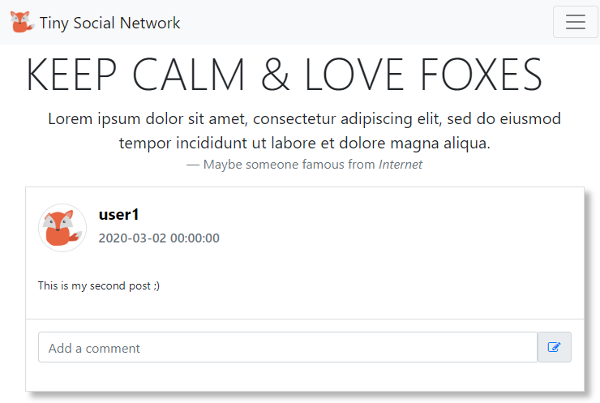
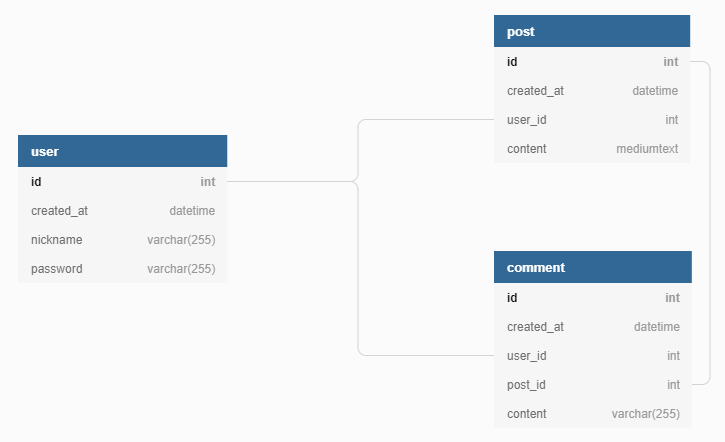

# Tiny Social Network

## Welcome

It's a *tiny social network* where **USER**s can **POST** messages and **COMMENT** these messages.

### Goal

This project was done for my PHP courses.
The goal is to discover the **PHP syntax** and use **PDO** (PHP Data Objects)  for accessing databases.




### Database

The structure is really simple:



### MVC

It's a simple **MVC** implementation **without OOP** (Object-Oriented Programming) in **PHP** .

```
+---config/
|       data.sql
|       structure.sql
|       
+---controllers/
|       controller.php
|       
+---models/
|       PDO.php
|       PostManager.php
|       CommentManager.php
|       UserManager.php
|       
+---views/
|       DisplayPosts.php
|       
\---web/
    |   index.php
    |   
    +---css/
    +---img/       
    \---js/
```

## Getting Started

These instructions will get you a copy of the project up and running on your local machine.

### Prerequisites

You need to have a **L.A.M.P.** architecture working on your computer.

Else you need to install the missing parts.

**MySQL server**:

```sh
sudo apt-get install mysql-server
```

If the secure installation utility does not launch automatically after the installation completes, enter the following command:

```sh
sudo mysql_secure_installation utility`
```

**Apache2 server**:

```sh
sudo apt-get install apache2
```

And start them:

```sh
sudo systemctl start apache2
sudo systemctl start mysqld
```

### Installing

- **Fork** this repo and **clone** it on your computer inside the **DocumentRoot** of apache (by default it should be inside /var/www/html).

  ```sh
  cd /var/www/html
  git clone https://github.com/YOUR-USERNAME/socialnetwork
  ```

- Create an populate the database:

  Go into the **config directory** and run the <u>2 SQL scripts</u> (replace **dbuser** by the right user)

  ```sh
  cd socialnetwork/config
  mysql -u <dbuser> -p < structure.sql
  mysql -u <dbuser> -p < data.sql
  ```

  - You can connect to the database **tsn** to see if the database and the table were well created

    ```sh
    mysql -u root -p
    > use tsn;
    > show tables;
    > select * from user;
    ```

- Go into the **models directory** and modify **PDO.php** to set the right credentials.

```php
<?php
  $db_user = "root";
  $db_passwd = "toor";
  $db_host = "localhost";
  $db_port = "3306";
  $db_name = "tsn";
  $db_dataSourceName = "mysql:host=$db_host;port=$db_port;dbname=$db_name";

  $PDO = new PDO($db_dataSourceName, $db_user, $db_passwd);
  $PDO->setAttribute(PDO::ATTR_ERRMODE, PDO::ERRMODE_EXCEPTION);
?>

```

- Now if you go on your web browser you should see something:

  http://localhost/socialnetwork/web/

## Exercise 1

The posts are dynamically retrieved from the database, nonetheless, the comments are hardcoded.

**<u>Final Goal</u>: You have to retrieve these comments dynamically for each post.**

### 1 - Show me the code

Have a look inside the project to **understand each line of code**.
Start with the entry point, the *index.php* inside the **web directory**.
And follow the execution to understand the whole project.

```php
<?php
  include "../controllers/controller.php";
?>
```

### 2 - Use Git in the right way

Never work on the **master** branch, so start to create a **develop** branch from master and push it to GitHub.

```sh
git checkout -b develop
git push -u origin develop
```

As you will work on the feature to retrieve comments, create a new branch **feature/retrieveComments** from develop and push it to GitHub.

```sh
git checkout -b feature/retrieveComments
git push -u origin feature/retrieveComments
```

Now you are ready to code.

### 3 - Do the job

If you have a look to *controllers/**controller.php*** you'll see some fake data about comments:

```php
case 'display':
    include "../models/PostManager.php";
    $posts = GetAllPosts();

    include "../models/CommentManager.php";
    $comments = array();

    // ===================HARDCODED PART===========================
    $comments[1] = array(
        array("nickname" => "FakeUser1", "created_at" => "1970-01-01 00:00:00", "content" => "Fake comment 01."),
        array("nickname" => "FakeUser2", "created_at" => "1970-01-02 00:00:00", "content" => "Fake comment 02."),
        array("nickname" => "FakeUser1", "created_at" => "1970-01-03 00:00:00", "content" => "Fake comment 03.")
    );
    $comments[3] = array(
        array("nickname" => "FakeUser1", "created_at" => "1970-01-01 00:00:00", "content" => "Fake comment 04."),
    );
    // =============================================================

    include "../views/DisplayPosts.php";
    break;
```
<u>You have to:</u>

1.  Go into *models/**CommentManager.php*** to create a new function who get all comments from a post id. Don't forget you need the nickname of the user who commented.

   ```php
   function GetAllCommentsFromPostId($postId) {
	// Code here...
   }
   ```

2. Inside *controllers/**controller.php*** remove the *hardcoded part*.

3. Instead, loop over **$posts** and call your new function **GetAllCommentsFromPostId** <u>for each post</u> giving the post id.

4. Fill the **$comments** array with the results. The key is the id of the post and the value the result of your function.

### 4 - Test and Save

When all is ok, **commit your changes** and **push** your branch to GitHub.

You can **merge your feature branch into develop** and **push** develop !!!
